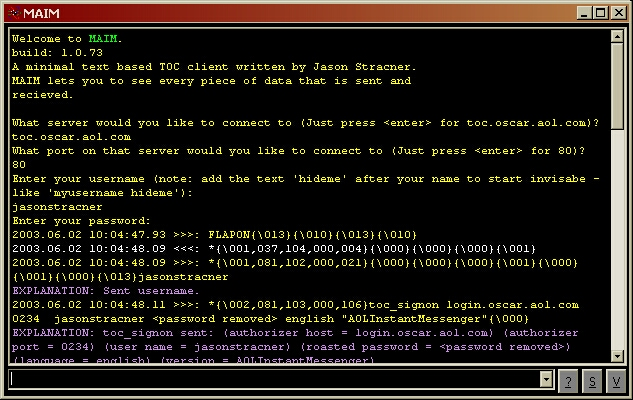



## MAIM \(an AIM clone\)

### Description

This is an AIM (aol instant messenger) clone. It demonstrates how to connect and send messages to the AOL server by using the TOC protocol.
 
### More Info
 

             |
---                |---
**Submitted On**   |2003-06-02 09:58:22
**By**             |[Jason Stracner](https://github.com/Planet-Source-Code/PSCIndex/blob/master/ByAuthor/jason-stracner.md)
**Level**          |Advanced
**User Rating**    |4.7 (28 globes from 6 users)
**Compatibility**  |VB 6\.0
**Category**       |[Complete Applications](https://github.com/Planet-Source-Code/PSCIndex/blob/master/ByCategory/complete-applications__1-27.md)
**World**          |[Visual Basic](https://github.com/Planet-Source-Code/PSCIndex/blob/master/ByWorld/visual-basic.md)
**Archive File**   |[MAIM\_\(an\_A159570622003\.zip](https://github.com/Planet-Source-Code/jason-stracner-maim-an-aim-clone__1-45904/archive/master.zip)

